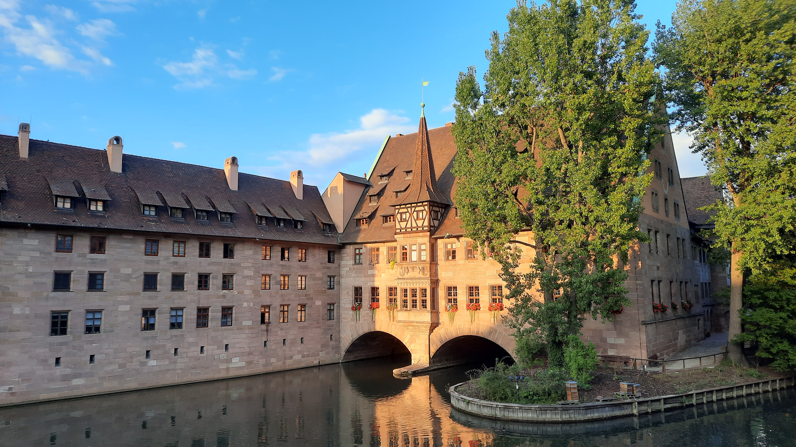
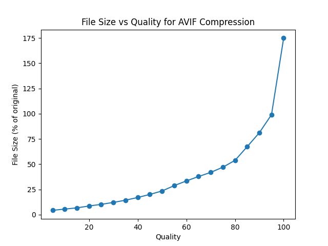

# MisterAVIF

Find the correct AVIF compression settings for your images by visually comparing images

Give `MisterAVIF` an image and he will compress in from quality 5 to 100 in steps of 5.

It will also extract some small sections of the image to compare the compression quality visually, which is helpful for high-resolution images.

## Example

As an example, take this photo of Nuremberg, Germany(made by me, open-sourced under CC0):



In the original compression from the camera, it's `3.2MB` large.

Let's use `MisterAVIF` to compress it to different qualities and compare the results.

```bash
misteravif examples/Nuremberg.jpg
```

`MisterAVIF` will now take its time to generate all the different compression levels. For this image and on my machine, this takes about `1:34` minutes (yeah, AVIF encoding is slow, but it's equally effective).

It will create a director `examples/Nuremberg` with the following files:

```
-Filesizes.png
Original.jpg
q05.avif
q100.avif
q10.avif
q15.avif
q20.avif
q25.avif
q30.avif
q35.avif
q40.avif
q45.avif
q50.avif
q55.avif
q60.avif
q65.avif
q70.avif
q75.avif
q80.avif
q85.avif
q90.avif
q95.avif
Section a1.png
Section a2.png
Section a3.png
Section b1.png
Section b2.png
Section b3.png
Section c1.png
Section c2.png
Section c3.png
```

The `Original.jpg` is the original image, and the `qXX.avif` files are the compressed images with different qualities. You can use them to check out the complete image with a given quality level.

For example, checkout the `q05.avif` file, which is the lowest quality setting being generated.


Kind of looks the same as the above image, right? But the file size is only `144KB`, which is only `4.3%` of the size of the original image.

Well, that's because AVIF is great. However, when zooming it, you can see some compression artifacts. But instead of zooming in individually, checkout `Section b2.png`. `b` and `2` are coordinates of a small sub-image (`abc` and `123`). `MisterAVIF` generates nine such sections from every quality level, with `b2` being right in the middle of the image. It will then combine those images into a single image called `Section b2.png` (saved as PNG because it's lossless), so you can compare it directly:


As you can see, at the lower quality levels, the compression artifacts become more and more visible.

Typically, you would want to find the least quality setting that has an acceptable image quality for your use case (archiving vs distribution vs web use, each usecase can have different requirements). In my case, I choose `q=25` to be acceptable and just to be sure, I'll go to `q=30` to be on the safe side. With `q=30`, even the individual roof tiles are still easily discernable - keeping in mind this is only a zoomed-in section of the image, the full image looks great at that quality level:

What's interesting now is to take a look at the `Filesizes.png` file, which is a chart of the file sizes of all the generated files:



As you can see, from a certain point, decreasing the quality has diminishing returns on decreasing the file size, while substantially degrading visual quality of the image. Depending on the typical resolution, source encoding and other factors, this point can be different, so my recommendation is to select the quality level using `misteravif` for a complete set of more or less similar images, not for your entire photo collection at once.

Here's the final image we selected: `q30.avif`, with a filesize of `400k`, that is `12.1%` of the origin image's size, but still looking great:


